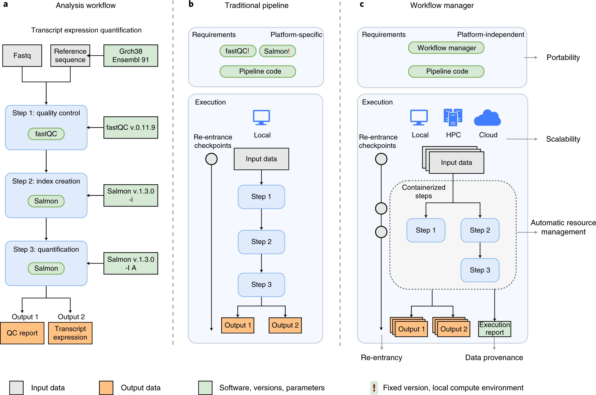
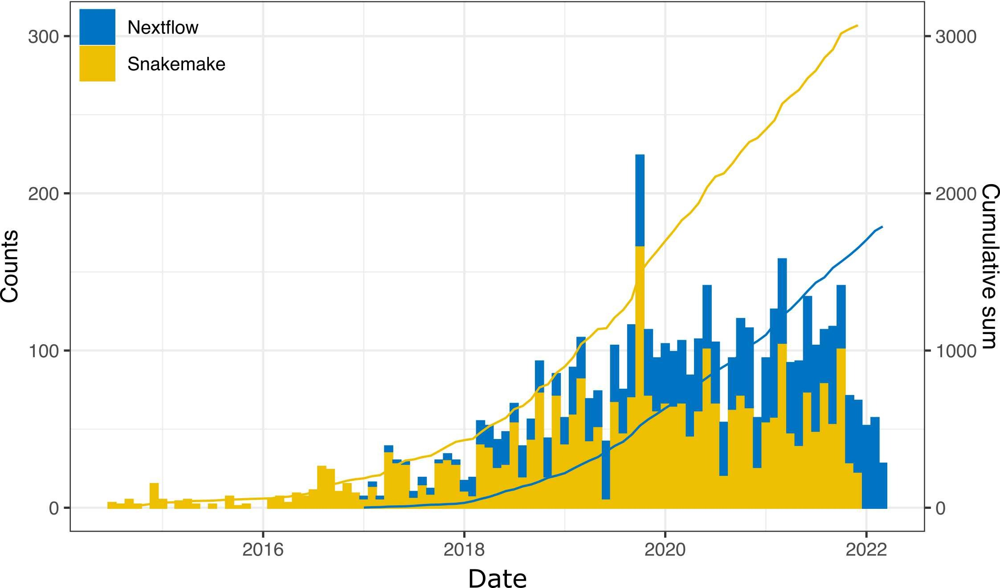
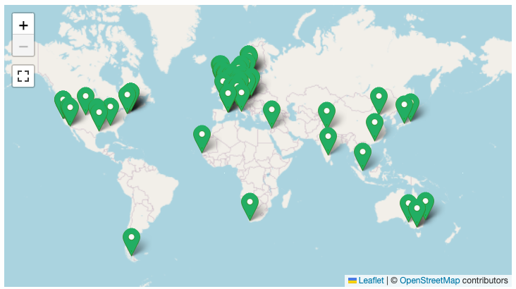
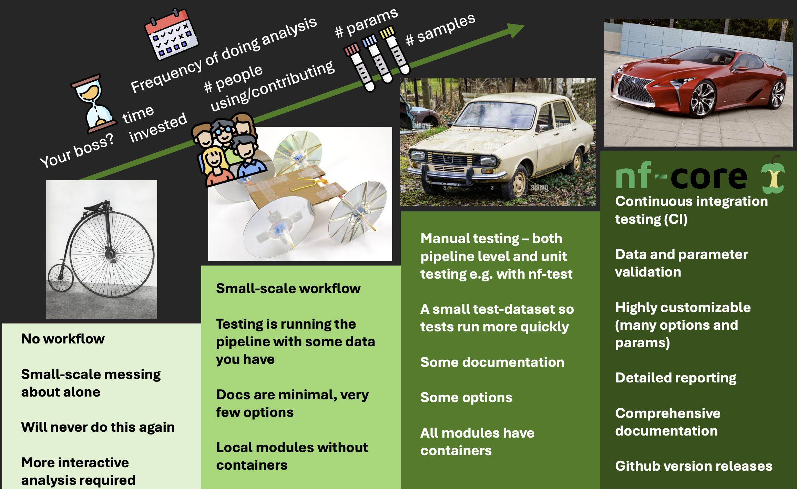

A pipeline or workflow connects multiple programs together to analyse data.

::: {.figure .center}
{width="75%"}
:::

------------------------------------------------------------------------

## Nextflow or Snakemake?

::: {.figure .center}
{width="75%"}
:::

## Why Nextflow?

::: columns
::: {.column width="40%"}
-   [nf-core]{style="color: #3ac486;"} community project:
    -   127 pipelines
    -   1443 modules
    -   Slack workspace with 11,642 members
-   GUIs such as Seqera platform, flow.bio
:::

::: {.column width="60%"}
{width="100%"}
:::
:::

## When to write a Nextflow pipeline?

{fig-align="center"}

## Let's dive into Nextflow together: Set up

You will need:

-   Nextflow

-   A container engine (Docker/Singularity/Apptainer)

Today, we are providing a training environment in GitHub Codespaces with all dependencies pre-installed. You will need a GitHub account.

## Let's dive into Nextflow together ⚔️

Open in 2 separate tabs:

-   All documentation for this workshop: <https://training.nextflow.io/2.1.2/hello_nextflow/>

-   Training environment: <https://codespaces.new/nextflow-io/training?quickstart=1&ref=2.1.2>

## Important resources

::: {.cell style="font-size: 60%;"}
-   Nextflow and nf-core docs: <https://www.nextflow.io/docs/latest/index.html> and <https://nf-co.re/docs/>
-   Nextflow training: <https://training.nextflow.io/>
-   Forum for Nextflow questions: <https://community.seqera.io/>
-   nf-core Slack workspace: <https://nf-co.re/join/slack>
-   Seqera AI: <https://seqera.io/ask-ai/chat>
-   VSCode Nextflow integration: <https://nextflow.io/docs/latest/vscode.html>
-   nf-core/bytesize on YouTube: <https://nf-co.re/events/bytesize>
-   Annual Nextflow Summit and hackathon in Barcelona, Boston and hybrid
-   Our intermediate-level Nextflow workshop: <https://github.com/iraiosub/nextflow_in_action>
-   Seqera's nf-test training: <https://training.nextflow.io/2.1.4/side_quests/nf-test/#10-initialize-nf-test>
:::
