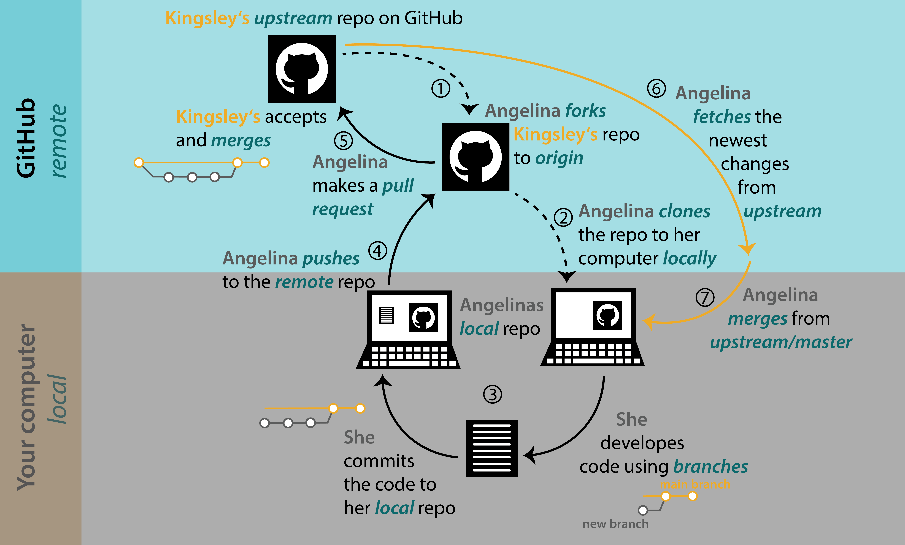
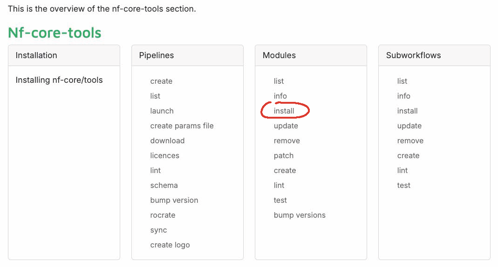

A pipeline or workflow connects multiple programs together to analyse data.

::: {.figure .center}
{width="75%"}
:::

------------------------------------------------------------------------

## Nextflow or Snakemake?

::: {.figure .center}
{width="75%"}
:::

## Why Nextflow?

::: columns
::: {.column width="40%"}
-   [nf-core]{style="color: #3ac486;"} community project:
    -   145 pipelines
    -   1764 modules
    -   Slack workspace with 14,120 members
-   GUIs such as Seqera platform, flow.bio
:::

::: {.column width="60%"}
{width="100%"}
:::
:::

## When to write a Nextflow pipeline?

{fig-align="center"}

## Let's write a toy pipeline together

{fig-align="center"}

## Set up

You will need:

-   Nextflow (25.10.2 - 25.10.4)

-   A container engine (Docker/Singularity/Apptainer)

-   nf-core tools (3.2.0 - 3.5.1)

-   nf-test (0.9.2 - 0.9.5)

-   Code editor (VSCode)

## Choose your own adventure! ⚔️ {.smaller}

All documents/code for this workshop: `github.com/iraiosub/nextflow_in_action`.

Lecture slides: `docs/Lecture.qmd.`

Choose what environment you will work with today:

1.  GitHub Codespaces
2.  Your laptop - we recommend downloading Docker (ensure Dockerhub is running whenever you want to use it) and then using conda/mamba to install everything else: `mamba create -n nf -c conda-forge -c bioconda nf-core=3.5.1`
3.  CREATE - instructions in `docs/CREATE_setup.md`

## Getting the code {.smaller}

-   Fork our GitHub repo `github.com/iraiosub/nextflow_in_action`
-   Uncheck the box that only forks the main branch.
-   If you are working on GitHub codespaces, switch to branch `1`, go to "Codespaces" tab and click `Create codespace on 1`.
-   If you are working on CREATE or locally, clone the repo.
-   Checkout branch `1` to get started.

{width="70%"}

## Let's write a toy pipeline together

{fig-align="center"}

## Ready to go!

::: {style="font-size: smaller"}
``` nextflow
nextflow_in_action/
├── bin/                      # Scripts used by processes
│   ├── extract_sequence.sh
│   ├── mean_gc_content.sh
│   ├── reverse_complement.sh
│   └── sequence_length.sh
├── conf/                     # Configuration files for the pipeline
│   └── modules.config        # Module behavior
├── data/                     # Input FASTQ files
│   ├── human_1.fastq
│   ├── human_2.fastq
│   ├── mouse_1.fastq
│   └── mouse_2.fastq
├── modules/                  # Nextflow DSL2 modules
│   └── local/                # Custom modules
│       └── extract_sequence.nf
├── main.nf                   # 🚀 Main pipeline script
├── nextflow.config           # 🔧 Global config (params, profiles, resources)
└── samplesheet.csv           # 📋 Sample metadata used as input
```
:::

## Building the input channel

::: {style="font-size: smaller"}
🔧 Input is read from a CSV in `main.nf`:

``` nextflow
Channel
  .fromPath(params.input)
  .splitCsv(header: true)
  .map { row ->
      def meta = [id: row.sample, org: row.org]
      def reads = file(row.fastq, checkIfExists: true)
      [meta, reads]
  }
```
:::

## Building the input channel

::: {style="font-size: smaller"}
🔧 Input is read from a CSV in `main.nf`:

``` nextflow
Channel
  .fromPath(params.input)
  .splitCsv(header: true)
  .map { row ->
      def meta = [id: row.sample, org: row.org]
      def reads = file(row.fastq, checkIfExists: true)
      [meta, reads]
  }
```

-   `[meta, reads]` is a channel of pairs (tuples): `meta` is a map (`[id: 'human_1', org: 'human']`) and `reads` is a FASTQ file.
-   Keeps metadata and data together as they flow through the pipeline.
-   `id` and `org` are accessed as `meta.id` and `meta.org`
:::

## Task 1

::: center
🎯 Add a FastQC step using nf-core tools

💡 Hint: To run the pipeline `nextflow run main.nf -profile ...`

💡 Hint: Want to rerun your pipeline **without starting over**? Just add `-resume` and pick up where you left off!
:::

## Task 1: nf-core modules to the rescue!

::: center
🎯 Add a FastQC step using nf-core tools

{fig-align="center" width="500px"}

`nf-core modules install fastqc`
:::

## Task 2

::: center
🎯 Write your own module to calculate sequence length and add it to the pipeline

💡 Hint: Look in the bin folder

`sequence_length.sh` usage:

``` bash
sequence_length.sh input.tsv output.tsv
```
:::

## Task 3

::: center
🎯 Write a module to reverse complement the sequences

🎯 Add a parameter to make the reverse complement step optional
:::

## Task 4

::: center
🎯 Write a module to calculate the mean GC content of the sequences

🎯 Use the same module twice in your pipeline. First, to calculate the mean GC content of each individual sample and then secondly, to calculate the mean GC content of sequences belonging to each organism/species.

💡 Hint: You will need to manipulate the channels being passed to your module. You can view your channel structure using view(), e.g. `ch_sequences.view {println "Sequence channel structure: $it" }`
:::

## Task 4: taming the data stream

::: incremental
::: {style="font-size: smaller"}
-   **Channel structure from `EXTRACT_SEQUENCE.out.sequence`:** `[meta, seq]` → `meta` is a map that includes the `id` and `org` fields.

-   **Goal:** Group all sequences by `org` → Required for computing GC content per group.

-   **Step 1 – Map to `[org, seq]`:**

    ``` nextflow
    .map { meta, seq -> [meta.org, seq] }
    ```

    → Makes the org easy to access for grouping.

-   **Step 2 – Group by `org`, now the first element (index 0) of each item:**

    ``` nextflow
    .groupTuple(by: [0])
    ```

    → Groups sequences under the same id, resulting in a channel of grouped tuples: \[org, \[seq1, seq2, ...\]\]
:::
:::

## Task 5

::: center
🎯 Add a MultiQC step to finish your pipeline. The MultiQC report should contain a summary of all the FastQC reports for each sequence.

💡 Hints: MultiQC is an nf-core module. This will require some channel manipulation!
:::

## 'Task 5' 2: A good day to 'Task 5'

::: center
🎯 Wow, MultiQC sure has a lot of useless inputs - let's edit the module to get rid of some of those. But what if you want to update the module from nf-core, won't that cause problems?

💡 We will show you how to use `nf-core modules patch` and `nf-core modules update` to solve this!
:::

## Task 6

::: center
🎯 Use `ext.args` to generalise your GC content module so that you can also calculate AT content. Use `conf/modules.config` to set the `ext.args` for each time you import the module.

💡 Hint: Look at the nf-core FastQC module to see how `ext.args` is used 💡 Hint: Remember to import `modules.config` in `nextflow.config`
:::

## Common headaches

-   Config hierarchies! You can convince yourself of this by messing around with where you set your `params.reverse_complement`... {fig-align="center"}

## Common headaches

-   Q: Why does only one sample run through the pipeline instead of all of them? A: Queue channels (e.g sample reads) vs. value channels (eg. genome reference).
-   If you print (with `println`) a channel variable and it’s a value channel, regardless of its content it will always show `DataflowVariable(value=null)`. A queue channel on the other hand will print `DataflowBroadcast around DataflowStream[?]`.

## Important resources

::: {.cell style="font-size: 80%;"}
-   Nextflow and nf-core docs
-   Nextflow training: `https://training.nextflow.io/`
-   nf-core Slack workspace
-   Forum for Nextflow questions: `https://community.seqera.io/`
-   Seqera AI `https://seqera.io/ask-ai/chat-v2`
-   VSCode Nextflow plugin
-   nf-core/bytesize on YouTube
-   Annual Nextflow Summit and hackathon in Barcelona, Boston and hybrid
:::

## Well done you made it to Task 7 🎉

::: center
🎯 Let's add tests to our pipeline with nf-test

💡 Hint: We will follow Seqera's nf-test training together: `https://training.nextflow.io/2.1.4/side_quests/nf-test/#10-initialize-nf-test`
:::
